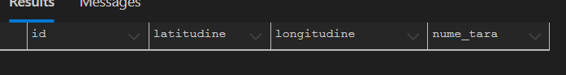
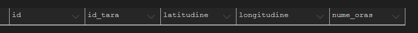
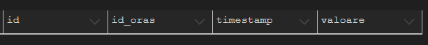

Student: Mihai Dragos-Andrei

Group: 342C5

# Theme 2 SCD

---

# Introduction

The technologies used for the development of the project were Spring Boot (Java) for the server 
and MS SQL (Microsoft Server SQL) for the database.

## **Server Implementation**

#### The server is built on an MVC architecture supported by a larger set of specific classes:
* **@Controller:** Its role is to expose a series of endpoints to the final client.

* **@Server:** Its role is to define the server's logic.

* **@Repository:** Its role is to expose a series of requests to the database being used. By default, JPA assists with 
several basic functions that have been inherited by all repositories in the application.

* **Dto:** These are structures designed to define the objects used in direct communication with the final client. 
They set attributes and basic conditions, which are validated on each request if the @Valid annotation is used.

* **@Entity:** Its role is to define the structure of the tables in the database. Each attribute of the class serves 
to define a column in the database. It also sets constraints that will be reflected in the database. Additionally, 
it defines the relationships between the database objects.

* **@Mapper:** Its role is to convert a Dto object to an @Entity and vice versa. It is called within components of 
type @Service. It is implemented to convert only the attributes with the same name, while the rest, which are specific
to an object, are ignored.

* **@ControllerAdvice / Handlers:** Its role is to capture exceptions at the server level and to implement a default 
function triggered when such an exception is thrown.

## **Database Implementation**

---
#### The database tables are created by the @Entity after establishing the connection.

* Tari

* Orase

* Temperaturi

  
### **Docker Container Definition**

---
#### For this project, I used a docker-compose file to define the containers. 

* It initializes a database using a pre-built image from DockerHub. 

* Data persistence in database is ensured by defining a volume managed by the Docker agent. 

* To initialize the Spring server, I used a Dockerfile based on a Maven image with Java 17, to which I added the server 
source code and the `pom.xml` file for dependency management. 

* For the server, a series of environment variables have been defined, which are then used for its configuration in 
the `application.yml` file. Each environment variable is followed by a default value. The default values were used for 
running the server locally and are only used if the environment variables are not defined.

* The environment variables for the database are used to define the admin username and password.

* The DNS technology provided by Docker is used in the server. When running a container, a variable "DATABASE_IP" is 
defined, which holds the name of the database service. For local execution, where Docker's DNS technology cannot be 
used, "localhost" is used instead.

* Both containers were added to a network named "global."

# Execution

#### To initialize the server and database containers:

    docker-compose up --build

#### To delete containers 
    
    docker-compose down --volumes
